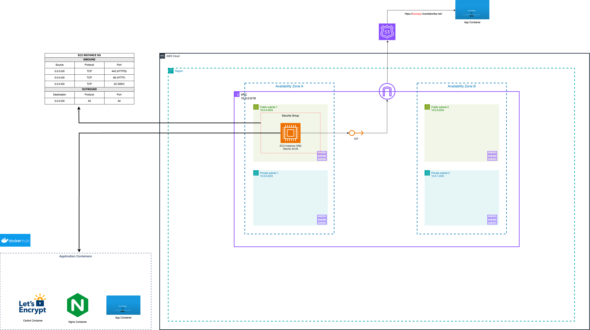

# SRE - NGINX Reverse Proxy with SSL

## Overview

The present project provides an automated solution for deploying a [simple web application](https://github.com/dockersamples/linux_tweet_app) with Nginx as a reverse proxy and SSL certificates from Let's Encrypt. The infrastructure solution is provided on AWS using Terraform, and the application components are containerized using Docker and Docker Compose.

## Purpose

The primary goals of the project are:

- Find a way to automate the complete solution, from infra to app deploying inside the infra.
- Implement secure HTTPS access using Let's Encrypt certificates

## Architecture



The main components of the Infrastructure solution are:

- **AWS VPC**: A virtual private network to isolate the solution in a network.
- **Security Group**: Because is a public facing application, I enable access through HTTP, HTTPS. The SSH Access main for trouble shooting and simplification of the solution.
- **Elastic IP (EIP)**: Public IP are not persistent when you start and stop an EC2 Instance, therefore to avoid this issue I'm using Elastic IP.
- **Route 53**: You need to register a domain with you chosen domain registrar. The solution only create a **A Type Record Set** inside your Hosted Zone pointing to the EIP.

The components of the the Application are:

- **App Container**: Simple web app. This container can be replaced with any type of application as long as the app container is exposed to the port 80.
- **Nginx Container**: Reverse proxy configured to listen on external ports 80 (HTTP) and 443 (HTTPS) and redirect incoming requests to the App container (Simple web app).
- **Certbot Container**: Manage SSL certificate generation and renewal.

## Technologies Used

- **Terraform**: Infrastructure as Code tool that help me to provision AWS resource automatically. I've chosen this tool because it allows me to recreate the required infra in a consistent state and to avoid using the aws console.
- **AWS**: Cloud provider for hosting the infrastructure. I've chosen AWS because it is my preferred cloud provider.
- **Docker & Docker Compose**: This two tools allow us to create small VM to host and configure the application. I've chosen these tools for portability and scalability because moving the application to another Platform as a Service (PaaS) like a container orchestration (AZK, EKS, ECS, Nomand) is easier.
- **Shell Scripts**: Help me with the automation of the process. By just running a script I can deploy the end to end solution.
- **EC2 User data**: Allows me to configure the EC2 Instance with the simple web application.

## Deploy solution locally

Here you will find the instructions to deploy the end to end solution on your local machine. I assume that you already have an AWS Account.

### Prerequisites

1. **AWS CLI** - Installed and configured with credentials that have the required permissions to deploy all the resources mentioned before.
2. **Terraform** - Installed and available in you PATH, so you can run terraform commands.
3. **Domain Name** - A registered domain with a Route 53 hosted zone configured.
4. **Git** - You will need it to clone the project.
5. **Bash Shell** - The deployment scripts are written for Bash.

### Deployment Steps

1. Clone the repository:

```
$ git clone https://github.com/Richardbmk/sre-nginx-ssl-certs.git
$ cd sre-nginx-ssl-certs
```

2. Make sure the deployment script is executable:

```
$ chmod +x automation-scripts/deploy.sh
```

3. Run the deployment script with the required parameters:

```
./automation-scripts/deploy.sh [REGION] [EC2_NAME] [DOMAIN_NAME] [EMAIL]
./automation-scripts/deploy.sh "us-east-1" "nginxApp" "thebest.ricardoboriba.net" "rdobmk@gmail.com"
```

Parameters description:

- _REGION_: AWS Region of you like to deploy the end-to-end solution. Example: "us-east-1"
- _EC2_NAME_: Tagged Name of the EC2 Instance. This is used to find the EC2 Instance ID. Example: "nginxApp"
- _DOMAIN_NAME_: Domain name for you want to use to deploy the application (must be on Route 53 that you control and own). Certbot/LetsEncrypt needed to generate the certificates. Example: "thebest.ricardoboriba.net"
- _EMAIL_: Contact email. Certbot/LetsEncrypt needed to generate the certificates. Example: "rdobmk@gmail.com"

4. Wait for the script completion:

- The infrastructure provisioning takes around 1-3 minutes to complete.
- The application deployment takes another 2-5 minutes to fully be completed.
- The script will provide updates about the status of the deployment.

5. Access the application:

- Once the deployment is complete, use the provided domain to access the application.

### Troubleshooting

If the deployment fails and you are not able to access the application, here are a list of things to check:

1. AWS Credentials are valid with sufficient permissions.
2. SSH into the EC2 Instance and check:
   - Docker & Docker compose are installed correctly
   - Existence of the folder with the name _sre-nginx-ssl_ and check the content on the folder
   - Check if the containers are in running: _sre-nginx-ssl-app_ and _nginx_
   - Check the container logs
   - Check if the certificates have been created.
3. Check the use data script in the EC2 instance.
4. Domain name is correctly configured in Route 53.

### Clean up

To destroy all the created resources run:

```
terraform destroy -var "region=us-east-1" -var "subdomain_name=thebest" -var "domain_name=ricardoboriba.net"
```
